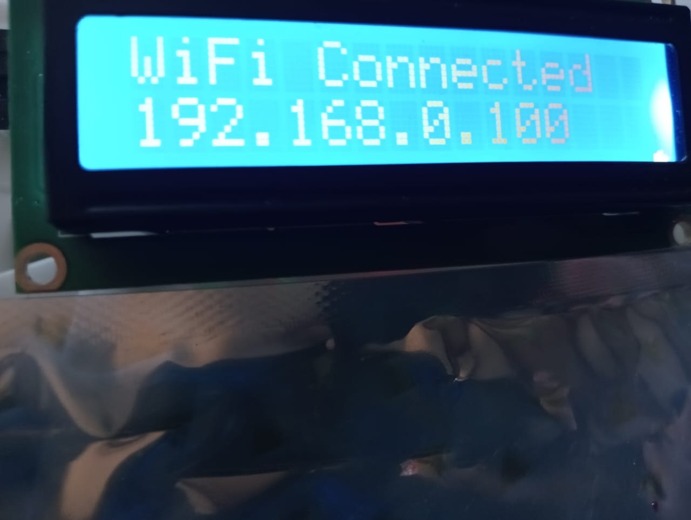
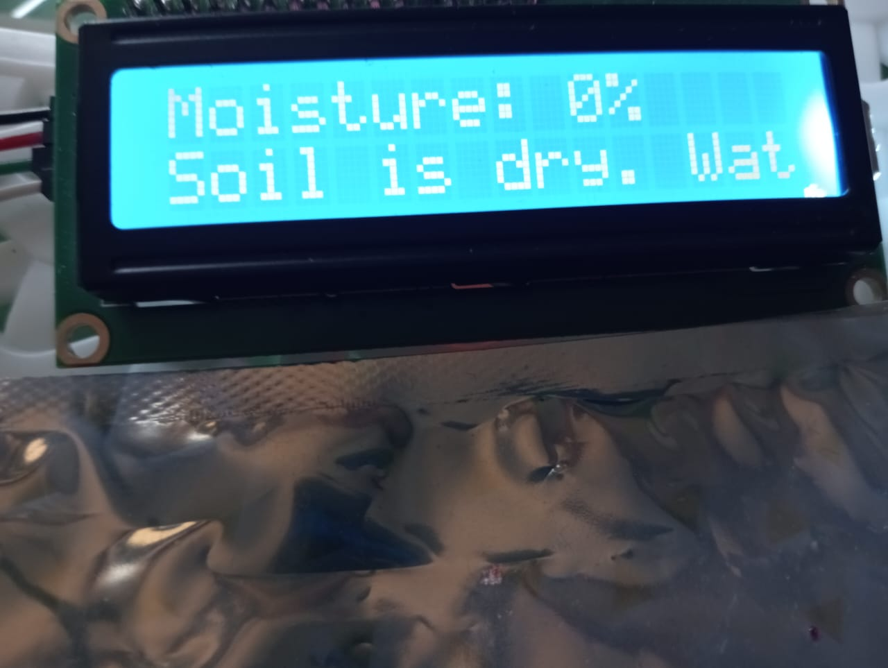
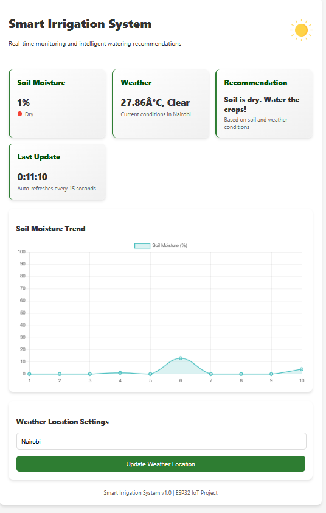

# 🌱 Real-Time Soil Moisture Monitoring System (IoT-Based)

This is an IoT-based real-time soil moisture monitoring system using **ESP32**, **capacitive soil moisture sensor**, and **I2C LCD display**. It provides farmers with real-time feedback on soil conditions to optimize irrigation and enhance agricultural productivity.

---

## 📌 Features

- 🌾 Real-time soil moisture monitoring
- 📊 Moisture level displayed as a percentage on I2C LCD
- 🚨 LED alert when soil moisture is too low
- 💧 TT motor simulates water pump activation
- 🌐 ESP32 hosts a webpage showing live data and irrigation advice
- 🔌 Works offline, no internet required
- 📈 Expandable for cloud sync and multi-zone monitoring

---

## 🧠 Project Overview

### 🔍 Problem Statement
Traditional soil moisture monitoring is often manual, inaccurate, and inefficient. With climate change, unpredictable rainfall makes it difficult for farmers to know when and how much to irrigate. While IoT-based solutions exist, they are often too expensive or internet-dependent, making them inaccessible to smallholder farmers.

### 🎯 Objectives

#### General Objective:
To design and implement a cost-effective IoT-based soil moisture monitoring system that provides farmers with real-time, actionable data to enhance crop management and optimize agricultural productivity.

#### Specific Objectives:
- To assess the impact of real-time soil moisture data on water conservation and yield optimization.
- To develop a real-time IoT-based system for continuous and accurate soil moisture monitoring.
- To evaluate the system’s contribution to water conservation and crop sustainability.
- To visualize soil moisture trends with a chart for better decision-making.

---

## ⚙️ Tech Stack & Components

| Component | Description |
|----------|-------------|
| **ESP32** | Microcontroller with Wi-Fi & analog input |
| **Capacitive Soil Moisture Sensor** | Detects moisture level |
| **LCD 16x2 (I2C)** | Displays moisture % and IP address |
| **LED** | Alerts when soil is dry |
| **TT Motor** | Simulates irrigation system |  |can be added|
| **HTML + JS** | For ESP32-hosted webpage |
| **Arduino IDE** | For writing and uploading code |

---

## 🔌 How It Works

1. The sensor detects soil moisture levels and outputs analog values.
2. ESP32 reads this input and maps it to a percentage.
3. LCD displays the moisture percentage.
4. When soil is dry:
   - LED turns on.
   - TT motor simulates pump activation.
5. ESP32 hosts a local webpage showing moisture data and irrigation advice.

---

## 🧾 Code Highlights

```cpp
int moistureValue = analogRead(sensorPin);
int percentage = map(moistureValue, 0, 4095, 100, 0); /* You can also calibarate it to fit your soil type*/
lcd.setCursor(0, 0);
lcd.print("Soil Moisture:");
lcd.setCursor(0, 1);
lcd.print(percentage);
lcd.print("%");
```

---

## 📸 Project Snapshots

### 🧠 Circuit Diagram


### 📟 LCD Showing IP Address

  
*LCD displays the ESP32-hosted webpage IP address*

---

### 💡 LCD Showing Irrigation Advice

  
*Real-time irrigation recommendation based on sensor readings*

---

### 🌐 Web Page Output

  
*ESP32-hosted webpage showing live data and irrigation tips*

---

## 🚀 Future Improvements

- 📱 Bluetooth alerts for low moisture levels
- ☁️ Firebase integration for remote storage and trends
- 📈 Moisture trend graphs using Charts.js
- 🌦 Weather API for smart irrigation decisions(Openeather Api)
- 🗺 GPS-based zone tracking for large farms

---

## 🧪 Testing & Validation

- ✔️ Tested with both dry and wet soil conditions
- ✔️ Verified LCD and web output
- ✔️ Simulated response with TT motor
- ✔️ Ensured ESP32 web server works offline via IP access

---

## 📄 License

MIT License. Feel free to use, modify, or improve this project for your own learning or smart farming solution.

---

## 👨‍💻 Author

**Kevin Momanyi**  
Final Year Student – BSc Information Technology  
[LinkedIn](https://www.linkedin.com/in/kelly-kevin-769977287/) • [GitHub](https://github.com/kellyKevin) • [Email](mailto:kellymomanyi80@gmail.com)

---

## 🙏 Acknowledgments

- Arduino and ESP32 community
- Tinkercad for simulation
- My project partner: **Virginia Mbogo**
- Supervisor: **Nicholas Muriithi**